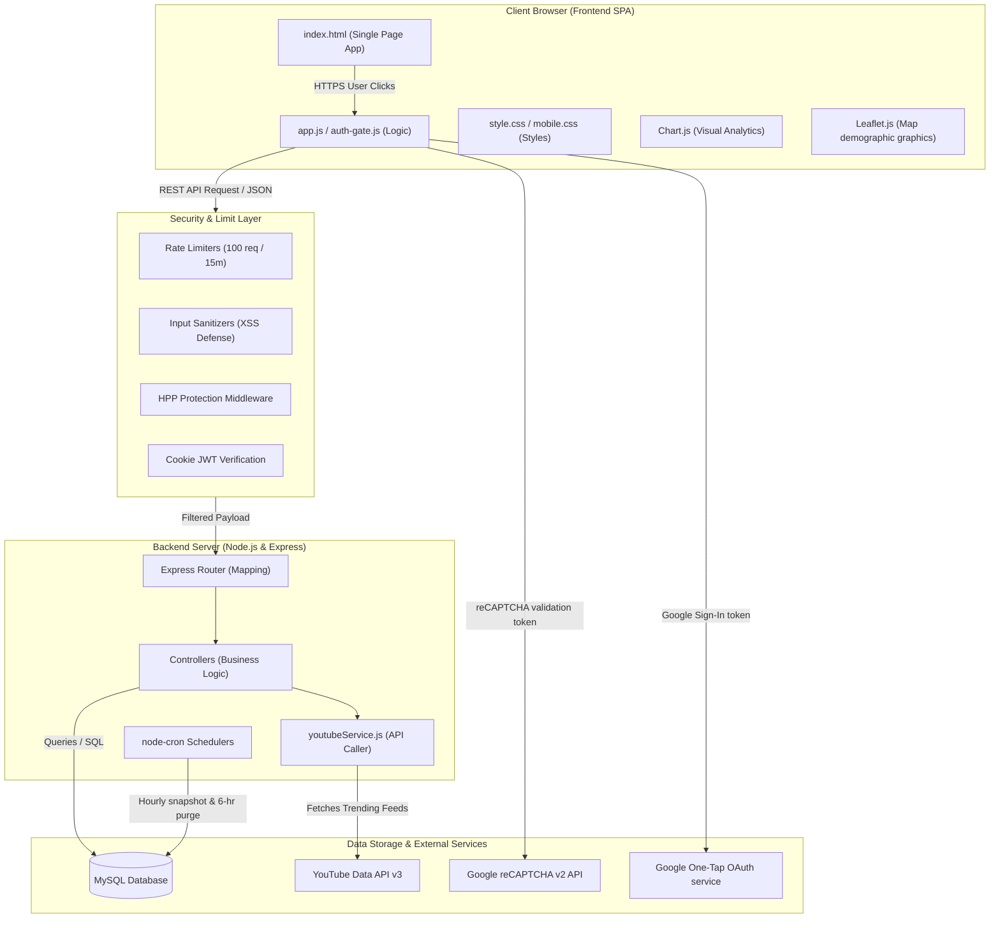
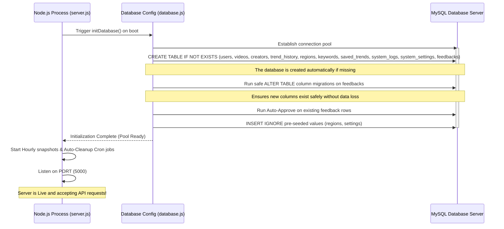
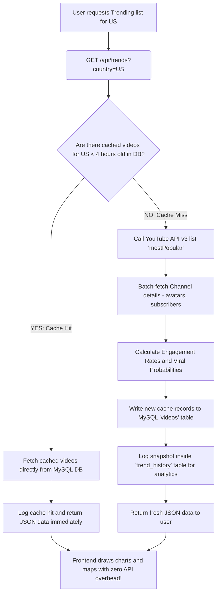
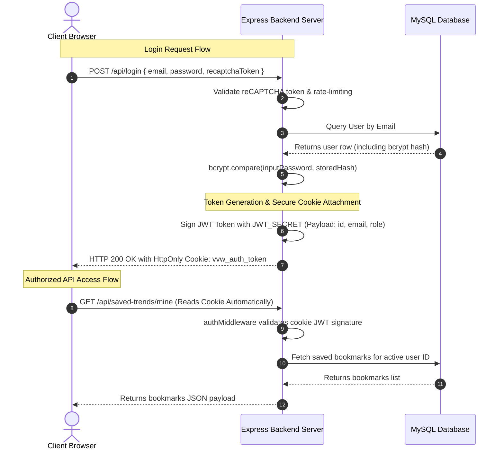

# TrendScope — System Architecture & Data Flow Diagrams

This document explains the technical architecture, operational pipelines, and data flows of the **TrendScope** system using visual Mermaid diagrams. It is designed to help you quickly understand how frontend, backend, database, and third-party APIs work together!

---

## 1. High-Level System Architecture

TrendScope uses a classic **Client-Server-Database** architecture. 
*   The **Frontend SPA** (Single Page Application) runs entirely in the user's web browser.
*   The **Backend Express Server** handles the business logic, session checks, security limits, and schedules.
*   The **MySQL Database** stores persistent records (users, history, logs) and caches heavy YouTube API feeds.



---

## 2. Server Boot & Database Initialization Flow

When the Node.js backend starts up (`npm start`), it goes through a safe, automated initialization pipeline to guarantee database integrity before starting the server.



---

## 3. Data Query Flow: Viewing Trends (Caching Strategy)

To save YouTube API quota (which has a daily maximum of 10,000 requests), TrendScope utilizes a highly efficient **Cache-First Caching Strategy**.



---

## 4. Authentication Architecture (JWT & HttpOnly Cookies)

TrendScope implements secure token-based authentication. 



---

## 5. Multi-Layer Security Architecture

TrendScope uses a comprehensive **defense-in-depth** strategy to secure every layer of the application.

```text
  [ Incoming HTTP Request ]
             │
             ▼
┌─────────────────────────────────────────┐
│ 1. Network Layer (express-rate-limit)   │ ──► Prevents denial of service & brute-force
└─────────────────────────────────────────┘
             │
             ▼
┌─────────────────────────────────────────┐
│ 2. HTTP Security Headers (Helmet / HPP) │ ──► Secures parameters and prevents XSS/CSRF
└─────────────────────────────────────────┘
             │
             ▼
┌─────────────────────────────────────────┐
│ 3. User Payload Sanitization            │ ──► Escapes HTML tags in inputs to block XSS
└─────────────────────────────────────────┘
             │
             ▼
┌─────────────────────────────────────────┐
│ 4. Authentication Layer (JWT & reCAPTCHA)│ ──► Confirms identity and blocks automation
└─────────────────────────────────────────┘
             │
             ▼
┌─────────────────────────────────────────┐
│ 5. Database Layer (Prepared Statements) │ ──► Escapes SQL parameters to block SQL injection
└─────────────────────────────────────────┘
             │
             ▼
  [ Safe Execution in Database ]
```

Happy studying! This visual architecture manual should give you a clear, structural map of the entire TrendScope platform. Let's make something great!
