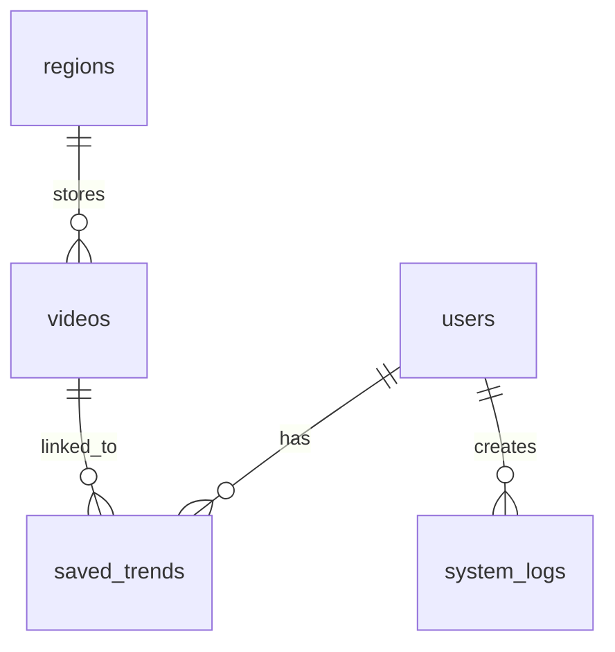

# TrendScope — Complete Technical Project Documentation & Handover Package

Welcome to the **TrendScope** Developer Handover Package! This handbook is written in clean, simple, student-friendly language to help you study, run, and understand the entire codebase without having to ask a single question.

---

## 1. Project Overview

### What is TrendScope?
**TrendScope** (also known as Vid Voyage World) is a real-time **YouTube Trends Explorer and Creator Analytics Dashboard**. 
When YouTube creators want to know what videos are popular, what categories are dominating, or what keywords have the highest momentum, they can use TrendScope. It crawls the YouTube API, performs smart calculations, caches data locally in a database, draws beautiful interactive charts, and lets users save/bookmark their favorite trends!

### Core Features
*   **Live Trends Dashboard**: Displays top trending videos, views, likes, comments, and engagement rates.
*   **Demographic Heatmaps**: Renders an interactive Leaflet map to explore trends geographically.
*   **Smart Analytical Metrics**: Calculates **Engagement Rate** `((likes + comments) / views)` and **Viral Probability** (an index representing growth momentum).
*   **Comparison Engine**: Compares `Today vs Yesterday` metrics to evaluate growth velocity.
*   **Saved Trends (Bookmarks)**: Logged-in users can bookmark specific videos to monitor performance in real-time.
*   **Testimonial & Feedback System**: Public users can write reviews and rate the site.
*   **Admin Dashboard**: Administrators can manage system settings (e.g. maintenance mode), change user roles, monitor anomalous botted traffic, and approve or hide public feedback.
*   **Auto-Cleanup Cron Job**: Prevents database bloating by automatically deleting historical trend records, cached videos, and keyword search logs older than 7 days.

### Technology Stack
*   **Frontend**: 
    *   **Core**: HTML5, Vanilla CSS3 (Custom styling, responsive designs).
    *   **Dynamic Actions**: Raw/Vanilla ES6 JavaScript (No heavyweight frameworks like React/Angular).
    *   **Interactivity**: Chart.js (for analytics graphs) and Leaflet.js (for map graphics).
    *   **Integrations**: Google Identity Services (One-Tap Sign-In) and Google reCAPTCHA v2 (bot prevention).
*   **Backend**: 
    *   **Runtime**: Node.js
    *   **Framework**: Express.js
    *   **Scheduler**: `node-cron` (runs hourly trend updates and 6-hour log purges).
*   **Database**: 
    *   **Engine**: MySQL (MySQL2/Promise client for asynchronous SQL queries).
*   **Deployment**: 
    *   **Hosting**: Railway (for both Backend and MySQL services) and GitHub Pages/Railway (for Frontend).

---

## 2. Folder Structure

Here is how the project files are organized.

```text
vid-voyage-world-main/
│
├── backend/                       # Node.js Express Server
│   ├── config/                    # Configuration and database setups
│   │   └── database.js            # MySQL Connection Pool and Auto-Migrations
│   │
│   ├── controllers/               # Business Logic for each route
│   │   ├── adminController.js     # Admin dashboard stats, logs, and settings
│   │   ├── authController.js      # User registration, login, and JWT logic
│   │   ├── feedbackController.js  # Ratings submission and moderation
│   │   ├── savedTrendController.js# Bookmark operations (create, read, delete)
│   │   └── trendController.js     # Querying trending videos and history
│   │
│   ├── middleware/                # Route filters / Interceptors
│   │   ├── authMiddleware.js      # JWT token checkers and Admin verification
│   │   ├── errorHandler.js        # Global error catcher
│   │   ├── recaptchaMiddleware.js # Google reCAPTCHA v2 token validator
│   │   └── securityMiddleware.js  # XSS filters, rate-limiters, input checkers
│   │
│   ├── routes/                    # API Endpoints Mapper
│   │   ├── adminRoutes.js         # /api/admin/* endpoints
│   │   ├── authRoutes.js          # Signup, login, and logout endpoints
│   │   ├── feedbackRoutes.js      # /api/feedback and /api/public-feedback endpoints
│   │   ├── savedTrendRoutes.js    # /api/saved-trends/* endpoints
│   │   └── trendRoutes.js         # /api/trends/* endpoints
│   │
│   ├── services/                  # Business services
│   │   ├── trendService.js        # History logs, auto-purges, comparison engine
│   │   └── youtubeService.js      # Fetches real-time feeds from YouTube API
│   │
│   ├── .env                       # Backend Secrets (untracked on Git)
│   ├── package.json               # Backend dependencies and startup scripts
│   └── server.js                  # Main server entry file
│
├── frontend/                      # Client-side Single Page Application (SPA)
│   ├── css/                       # Visual design sheets
│   │   ├── admin.css              # Styling specific to the Admin Portal
│   │   ├── mobile.css             # Fluid styles for smart phones and tablets
│   │   └── style.css              # Central stylesheet, color palettes, and glassmorphism
│   │
│   ├── js/                        # Client-side scripts
│   │   ├── admin.js               # Admin data fetching and UI rendering
│   │   ├── app.js                 # Main SPA navigation, Leaflet, and Chart.js dashboards
│   │   ├── auth-gate.js           # Session handling, signup, login, Google One-Tap
│   │   ├── feedback.js            # Rating submittal, stars animation, public feed
│   │   └── particles.js           # Renders interactive stars/particles on auth screens
│   │
│   ├── admin.html                 # Administrative Panel layout
│   ├── admin-login.html           # Administrator Portal access portal
│   ├── index.html                 # Main SPA application portal
│   ├── script.js                  # Universal configuration parameters (API_BASE)
│   └── package.json               # Frontend dependencies metadata
│
├── PROJECT_DOCUMENTATION.md       # (This file) Handbook and instructions
└── PROJECT_ARCHITECTURE.md        # Technical architectural visual layout
```

---

## 3. Frontend Explanation

### The Single Page Application (SPA) Flow
The client-side works as a **Single Page Application** (SPA) located inside `frontend/index.html`. Instead of loading new web pages, JavaScript captures menu clicks and displays or hides matching divisions (`<div id="section-trends">`, `<div id="section-history">`, etc.).

### HTML Pages & Roles
1.  **`index.html`**: The central application interface. Serves the main landing page, trending dashboard, interactive Leaflet world map, personal bookmarks, feedback drawer, and login/registration modal boxes.
2.  **`admin-login.html`**: A separate entrance point for administrative staff.
3.  **`admin.html`**: The administration management panel. Restricted to system administrators only.

### JavaScript Core Scripts
*   **`script.js`**: Contains configuration variables like `API_BASE` (currently pointing to `https://trendscope-production-7902.up.railway.app`) which points the frontend to the backend server.
*   **`js/auth-gate.js`**: 
    *   Manages token storage (`localStorage.getItem("token")`).
    *   Intercepts standard requests using the custom helper `AuthGate.authFetch(url, options)`. It injects `Authorization: Bearer <token>` and `credentials: 'include'` to allow secure cross-origin queries to the Railway backend.
    *   Powers the Login, Registration, Password Reset, and Google One-Tap integrations.
*   **`js/app.js`**:
    *   Fetches cached trends from the backend database or live YouTube feeds.
    *   Configures and instantiates Chart.js graphs for category distributions and engagement velocity.
    *   Draws the Leaflet.js world map, registering custom map pins that show trending activity for selected countries.
    *   Renders saved personal bookmarks.
*   **`js/feedback.js`**: Handles the stars input selector, submits new reviews to `/api/feedback`, and lists approved ones under the testimonial slider.
*   **`js/particles.js`**: Renders smooth, moving particle animations in the background of login screens.

---

## 4. Backend Explanation

### Server Architecture
The server is written on Node.js using the **Express** framework in a clean **MVC (Model-View-Controller)** pattern.
When `node server.js` runs:
1.  The database configurations connect to MySQL (`database.js`).
2.  Auto-migrations run to ensure all tables exist and columns are intact.
3.  Security middleware (Helmet, HPP, Sanitizers) are configured.
4.  API routers map endpoints to their specific controller functions.
5.  An hourly cron-job launches to fetch YouTube trends, and a 6-hour cron-job purges old logs.

### Key Middlewares
*   **`helmetConfig`**: Enhances HTTP header security to defend against common vulnerabilities.
*   **`hppProtection`**: Defends against **HTTP Parameter Pollution** (e.g. passing multiple duplicate parameters to break query syntax).
*   **`sanitizeBody`**: Scans `req.body` and automatically escapes HTML special characters (`<` to `&lt;`, etc.) to block **Cross-Site Scripting (XSS)**.
*   **`globalLimiter`**: Caps standard API requests to **100 requests per 15 minutes** per IP address.
*   **`requireAuth`**: Parses standard cookies and `Authorization: Bearer` headers, validates the signature via JWT, and attaches the user's details (`req.user`) to the request.
*   **`isAdmin`**: Halts non-administrators from accessing backend admin routes.
*   **`requireRecaptcha`**: Validates the reCAPTCHA token passed by the frontend with Google's verification API.

---

## 5. Database Documentation

TrendScope uses a relational MySQL database schema. The database is initialized and managed by `backend/config/database.js`.



### Table Breakdown

#### 1. `users`
Stores user profile information.
*   `id` (`INT`, Primary Key, Auto Increment)
*   `email` (`VARCHAR(255)`, Unique, Not Null)
*   `password_hash` (`VARCHAR(255)`, Nullable for Google sign-ups)
*   `full_name` (`VARCHAR(255)`, Not Null)
*   `role` (`VARCHAR(50)`, default `'user'`)
*   `google_id` (`VARCHAR(255)`, Unique, Nullable)
*   `country` (`VARCHAR(100)`, Nullable)
*   `gender` (`ENUM('male', 'female', 'other', 'prefer_not_to_say')`, Nullable)
*   `created_at` (`DATETIME`, default `CURRENT_TIMESTAMP`)
*   `last_login` (`DATETIME`, Nullable)

#### 2. `videos`
Caches trending videos retrieved from the YouTube API to save quota limits.
*   `id` (`INT`, Primary Key, Auto Increment)
*   `youtube_id` (`VARCHAR(64)`, Not Null)
*   `title` (`VARCHAR(500)`, Not Null)
*   `channel_name` (`VARCHAR(255)`, Not Null)
*   `thumbnail_url` (`VARCHAR(1000)`)
*   `views` (`BIGINT`, default 0)
*   `likes` (`BIGINT`, default 0)
*   `comments` (`BIGINT`, default 0)
*   `engagement_rate` (`DECIMAL(8,4)`, default 0)
*   `viral_probability` (`INT`, default 0)
*   `category` (`VARCHAR(100)`, default `'Entertainment'`)
*   `region` (`VARCHAR(10)`, default `'US'`)
*   `upload_date` (`VARCHAR(100)`)
*   `duration` (`VARCHAR(20)`)
*   `growth_rate` (`INT`, default 0)
*   `channel_subs` (`VARCHAR(50)`)
*   `channel_avatar` (`VARCHAR(1000)`)
*   `created_at` (`DATETIME`, default `CURRENT_TIMESTAMP`)

#### 3. `creators`
Aggregates metrics for YouTube channels producing trending videos.
*   `id` (`INT`, Primary Key, Auto Increment)
*   `channel_name` (`VARCHAR(255)`)
*   `subscriber_count` (`VARCHAR(50)`)
*   `total_views` (`BIGINT`)
*   `video_count` (`INT`)
*   `region` (`VARCHAR(10)`)
*   `channel_avatar` (`VARCHAR(1000)`)
*   `created_at` (`DATETIME`, default `CURRENT_TIMESTAMP`)

#### 4. `trend_history`
Maintains hourly historical logs of trending statistics. Used to draw the History chart.
*   `id` (`INT`, Primary Key, Auto Increment)
*   `video_youtube_id` (`VARCHAR(64)`)
*   `title` (`VARCHAR(500)`)
*   `channel_name` (`VARCHAR(255)`)
*   `thumbnail_url` (`VARCHAR(1000)`)
*   `views` (`BIGINT`)
*   `likes` (`BIGINT`)
*   `comments` (`BIGINT`)
*   `engagement_rate` (`DECIMAL(8,4)`)
*   `viral_probability` (`INT`)
*   `ranking` (`INT`)
*   `category` (`VARCHAR(100)`)
*   `region` (`VARCHAR(10)`)
*   `upload_date` (`VARCHAR(100)`)
*   `growth_rate` (`INT`)
*   `snapshot_date` (`DATETIME`, default `CURRENT_TIMESTAMP`)

#### 5. `regions`
Pre-seeded countries loaded by the Leaflet Map.
*   `id` (`INT`, Primary Key, Auto Increment)
*   `code` (`VARCHAR(10)`, Unique, Not Null) — e.g. `'US'`, `'GB'`, `'IN'`
*   `name` (`VARCHAR(100)`, Not Null) — e.g. `'United States'`
*   `total_trending_videos` (`INT`, default 0)
*   `avg_engagement` (`DECIMAL(8,4)`, default 0)
*   `avg_views` (`BIGINT`, default 0)
*   `top_category` (`VARCHAR(100)`)

#### 6. `keywords`
Tracks high-growth trending search terms.
*   `id` (`INT`, Primary Key, Auto Increment)
*   `term` (`VARCHAR(255)`)
*   `search_volume` (`INT`)
*   `heat_level` (`ENUM('LOW', 'MEDIUM', 'HIGH')`)
*   `growth_pct` (`DECIMAL(8,2)`)
*   `region` (`VARCHAR(10)`)
*   `snapshot_date` (`DATETIME`)

#### 7. `saved_trends`
Stores bookmarks linking users to bookmarked videos.
*   `id` (`INT`, Primary Key, Auto Increment)
*   `user_id` (`INT`, Foreign Key pointing to `users(id)`)
*   `video_youtube_id` (`VARCHAR(64)`)
*   `video_title` (`VARCHAR(500)`)
*   `channel_name` (`VARCHAR(255)`)
*   `thumbnail_url` (`VARCHAR(1000)`)
*   `views` (`BIGINT`)
*   `likes` (`BIGINT`)
*   `category` (`VARCHAR(100)`)
*   `region` (`VARCHAR(10)`)
*   `created_at` (`DATETIME`, default `CURRENT_TIMESTAMP`)

#### 8. `system_logs`
Logs admin activities for audit trails.
*   `id` (`INT`, Primary Key, Auto Increment)
*   `event_type` (`VARCHAR(50)`) — e.g. `'ROLE_UPDATE'`, `'USER_DELETE'`
*   `message` (`VARCHAR(500)`)
*   `user_id` (`INT`, Nullable)
*   `ip_address` (`VARCHAR(45)`)
*   `created_at` (`DATETIME`, default `CURRENT_TIMESTAMP`)

#### 9. `system_settings`
Global system parameters.
*   `setting_key` (`VARCHAR(100)`, Primary Key) — e.g. `'maintenance_mode'`
*   `setting_value` (`TEXT`)
*   `updated_at` (`DATETIME`)

#### 10. `feedbacks`
Stores feedback submitted by public users.
*   `id` (`INT`, Primary Key, Auto Increment)
*   `name` (`VARCHAR(255)`, Not Null)
*   `email` (`VARCHAR(255)`, Not Null)
*   `rating` (`INT`, Not Null)
*   `message` (`TEXT`, Not Null)
*   `is_approved` (`TINYINT(1)`, default 0) — 1 means approved (visible to public)
*   `is_hidden` (`TINYINT(1)`, default 0) — 1 means hidden by admin
*   `created_at` (`DATETIME`, default `CURRENT_TIMESTAMP`)

---

## 6. API Documentation

Here is the complete catalog of backend endpoints.

### Authentication Endpoints (`/api`)

| Method | Endpoint | Access | Purpose | Request Body | Response Example |
| :--- | :--- | :--- | :--- | :--- | :--- |
| `POST` | `/signup` | Public | Register new user. Rate-limited (5/hr) + reCAPTCHA required. | `{ "fullName", "email", "password", "recaptchaToken" }` | `{ "message": "User registered successfully!" }` |
| `POST` | `/login` | Public | Standard login. Rate-limited (10/15m) + reCAPTCHA required. Sets HttpOnly cookie. | `{ "email", "password", "recaptchaToken" }` | `{ "user": { "id", "email", "fullName", "role" } }` |
| `POST` | `/google-login` | Public | Sign in using Google One-Tap token. | `{ "token" }` | `{ "user": { "id", "email", "fullName", "role" } }` |
| `POST` | `/admin-login` | Public | Login portal for admins (locks after 5 failures). | `{ "email", "password" }` | `{ "user": { "id", "email", "fullName", "role" } }` |
| `POST` | `/logout` | Public | Clear JWT token cookie. | *None* | `{ "message": "Logged out successfully" }` |
| `GET` | `/verify-token` | Logged In | Validate token and return session user. | *None* | `{ "user": { "id", "email", "role" } }` |
| `GET` | `/recaptcha-key` | Public | Retrieve reCAPTCHA site key for client loading. | *None* | `{ "siteKey": "6Le..." }` |

### Trends & Cache Endpoints (`/api`)

| Method | Endpoint | Access | Purpose | Query Params | Response Example |
| :--- | :--- | :--- | :--- | :--- | :--- |
| `GET` | `/trends` | Public | Get trending videos for a region. Fetches and caches. | `?country=US` | `{ "videos": [...] }` |
| `GET` | `/categories` | Public | Get category statistics distributions. | `?region=US` | `{ "categories": [...] }` |
| `GET` | `/trends/history` | Public | Retrieve hourly historical timeline snapshot points. | `?region=US&days=7` | `{ "history": [...] }` |
| `GET` | `/trends/compare` | Public | Returns `Today vs Yesterday` comparison stats. | `?region=US` | `{ "comparison": { "currentAvgViews", "previousAvgViews", "growthPercent" } }` |

### Personal Bookmarks Endpoints (`/api/saved-trends`)

| Method | Endpoint | Access | Purpose | Request Body | Response Example |
| :--- | :--- | :--- | :--- | :--- | :--- |
| `POST` | `/` | Logged In | Save a video to personal bookmarks. | `{ "youtubeId", "title", "channelName", "thumbnailUrl", "views", "likes", "category", "region" }` | `{ "message": "Trend saved successfully!" }` |
| `GET` | `/mine` | Logged In | Retrieve bookmarks of the active user. | *None* | `[ { "id", "video_youtube_id", "video_title" } ]` |
| `GET` | `/mine/ids` | Logged In | Get array of active bookmarked YouTube IDs. | *None* | `[ "youtube_id_1", "youtube_id_2" ]` |
| `DELETE`| `/:id` | Logged In | Remove bookmark by record ID. | *None* | `{ "message": "Bookmark removed successfully" }` |

### Testimonial & Feedback Endpoints (`/api`)

| Method | Endpoint | Access | Purpose | Request Body / Query Params | Response Example |
| :--- | :--- | :--- | :--- | :--- | :--- |
| `POST` | `/feedback` | Public | Submit site review. Rate-limited (5/15m). | `{ "name", "email", "rating", "message" }` | `{ "message": "Thank you! Your feedback has been submitted for review." }` |
| `GET` | `/public-feedback`| Public | Fetch approved & non-hidden feedbacks. | *None* | `{ "feedbacks": [ { "id", "name", "rating", "message" } ] }` |
| `GET` | `/feedback` | Admin Only| Fetch all feedbacks for review moderation. | *None* | `[ { "id", "name", "rating", "is_approved" } ]` |
| `PUT` | `/admin/feedback/approve/:id` | Admin Only | Toggle/Approve a feedback. | *None* | `{ "message": "Feedback approved status updated" }` |
| `PUT` | `/admin/feedback/hide/:id` | Admin Only | Toggle/Hide a feedback. | *None* | `{ "message": "Feedback hidden status updated" }` |
| `DELETE`| `/admin/feedback/:id` | Admin Only | Delete feedback item. | *None* | `{ "message": "Feedback deleted successfully" }` |

### Admin Endpoints (`/api/admin`)

| Method | Endpoint | Access | Purpose | Request Body | Response Example |
| :--- | :--- | :--- | :--- | :--- | :--- |
| `GET` | `/overview` | Admin Only | Return system statistics (users, bookmarks, videos). | *None* | `{ "totalUsers", "activeUsers", "dbTrendsCount" }` |
| `GET` | `/users` | Admin Only | List all registered accounts. | *None* | `[ { "id", "email", "full_name", "role" } ]` |
| `PUT` | `/users/:id/role`| Admin Only | Change user permissions (`user` or `admin`). | `{ "role" }` | `{ "message": "User role updated successfully" }` |
| `DELETE`| `/users/:id` | Admin Only | Delete registered user. | *None* | `{ "message": "User deleted successfully" }` |
| `GET` | `/monitoring` | Admin Only | Identifies anomalous trends (e.g. abnormally low engagement rates). | *None* | `{ "anomalousTrends": [...] }` |
| `GET` | `/activity` | Admin Only | Retrieve activity audit system logs. | *None* | `[ { "id", "event_type", "message", "created_at" } ]` |
| `GET` | `/settings` | Admin Only | Fetch system settings configurations. | *None* | `{ "maintenance_mode": "false", "allow_signups": "true" }` |
| `PUT` | `/settings` | Admin Only | Update setting keys. | `{ "maintenance_mode", "allow_signups", "data_retention_days" }` | `{ "message": "Settings updated successfully" }` |

---

## 7. Deployment Documentation

### The GitHub Workflow
Your codebase is stored in GitHub. Since Railway is integrated directly with your repository (`main` branch):
1.  Every time you execute `git push origin main`, a GitHub webhook alerts Railway.
2.  Railway automatically triggers a new deployment build.

### The Railway Deployment Process
1.  **Build Phase**: Railway detects the `package.json` file in the backend folder and runs `npm install` to download dependencies.
2.  **Startup Phase**: Railway triggers `npm start` (defined in `package.json` as `node server.js`).
3.  **Boot Phase**: On boot, the backend runs `initDatabase()` automatically. It updates schemas, runs safe column migrations, seeds default regions, and seeds a default admin account if none exists.

### Backend Environment Variables
To operate properly, ensure these values are populated in the **Variables** tab of the Railway Backend Service dashboard:

*   `PORT`: `5000` (Port the server runs on).
*   `NODE_ENV`: `production` (Configures Express and cookie rules for production).
*   `YOUTUBE_API_KEY`: *(Your YouTube Data API v3 credential key)*.
*   `JWT_SECRET`: *(A long secure randomized string to sign and encrypt session tokens)*.
*   `JWT_EXPIRY`: `24h` (Standard validation period for session tokens).
*   `RECAPTCHA_SITE_KEY`: *(The client-side site key from Google reCAPTCHA v2 console)*.
*   `RECAPTCHA_SECRET_KEY`: *(The secret validation key from Google reCAPTCHA v2 console)*.
*   `GOOGLE_CLIENT_ID`: *(The Google Web Application Client ID for One-Tap Sign-In)*.

### Railway MySQL Database Setup
1.  Create a **MySQL Database service** inside your Railway project workspace.
2.  Railway automatically creates and configures the environment variables (`MYSQLHOST`, `MYSQLUSER`, `MYSQLPASSWORD`, `MYSQLDATABASE`, `MYSQLPORT`) in your project's network scope.
3.  The database client in `backend/config/database.js` will automatically read these values on startup, connect to the database instance, create all tables, and run safe table migrations automatically. No manual SQL uploads are required!

---

## 8. Security Features

### 1. Robust JWT Session Protection
Authentication tokens are saved in the client's browser as **`HttpOnly` cookies** named `vvw_auth_token`.
*   **HttpOnly**: This flag prevents client-side JavaScript from reading the cookie value, defending the user against token theft via **Cross-Site Scripting (XSS)**.
*   **SameSite = Strict**: Restricts the browser from passing the cookie on cross-site requests, completely blocking **Cross-Site Request Forgery (CSRF)**.
*   **Authorization Header Fallback**: The API accepts a `Bearer <token>` authorization header to support cross-origin API testing securely.

### 2. Deep Input Sanitization (XSS Defense)
All string payloads sent in `req.body` are intercepted by the `sanitizeBody` middleware. It replaces dangerous character sequences with HTML safe entities:
*   `<` becomes `&lt;`
*   `>` becomes `&gt;`
*   `"` becomes `&quot;`
This prevents hackers from submitting `<script>alert('hacked')</script>` inside feedback or full name fields.

### 3. Smart Rate Limiting (Brute-Force Defense)
To prevent malicious bots from overwhelming the server or trying millions of passwords:
*   **General API limit**: 100 requests per 15 minutes per IP.
*   **User login limit**: 10 attempts per 15 minutes per IP.
*   **User signup limit**: 5 registration attempts per hour per IP.
*   **Admin portal login limit**: 5 attempts per 15 minutes per IP.
*   **Feedback/Review limit**: 5 submissions per 15 minutes per IP.

### 4. Prepared Statements (SQL Injection Protection)
Rather than constructing queries by joining strings together (e.g. `SELECT * FROM users WHERE email = '` + email + `'`), which allows SQL injection, the system exclusively uses **Parameterized Prepared Statements** via the `mysql2` client:
```javascript
db.execute("SELECT * FROM users WHERE email = ?", [email]);
```
The database treats input values strictly as strings, not executable SQL syntax.

### 5. reCAPTCHA v2 Validation
Automated scripts are blocked from creating fake accounts or spamming passwords by prompting a standard reCAPTCHA check. The server contacts Google's API to confirm reCAPTCHA scores before processing signups, logins, and password resets.

---

## 9. Step-by-Step Project Flows

Here is exactly what happens behind the scenes during major user actions:

### Flow 1: User Registration (Signup)
1.  **Client Entry**: The user opens the registration modal, inputs their Full Name, Email, and Password, resolves the Google reCAPTCHA, and clicks **Sign Up**.
2.  **Frontend Validation**: `auth-gate.js` verifies the email syntax and ensures the password is at least 6 characters.
3.  **API Request**: The client sends a `POST /api/signup` request with the signup details and the reCAPTCHA code.
4.  **Backend Safety Check**: The server runs the input through the `signupLimiter` and validates the reCAPTCHA token using `requireRecaptcha`.
5.  **Sanitization & Validation**: `sanitizeBody` escapes any scripts in the name field, while `validateUsername` blocks reserved keywords like `"admin"`.
6.  **Database Check**: The backend queries the `users` table to verify if the email is already registered.
7.  **Encryption**: The password is hashed securely using `bcrypt` (10 salt rounds).
8.  **Insertion**: The new user record is inserted into the `users` table. A success response is returned to the client.

### Flow 2: Standard User Login
1.  **Client Entry**: The user inputs their Email and Password, completes the reCAPTCHA, and clicks **Log In**.
2.  **API Request**: The client sends a `POST /api/login` payload.
3.  **Backend Verification**: The backend runs the input through `loginLimiter`, validates reCAPTCHA, and searches for the user email in the database.
4.  **Password Verification**: The backend compares the raw input password with the hashed password stored in the database using `bcrypt.compare()`.
5.  **Token Generation**: Upon verification, a JWT token containing the user's `id`, `email`, and `role` is signed using `JWT_SECRET`.
6.  **Cookie Attachment**: The token is packaged as a secure `HttpOnly` cookie and returned in the HTTP response.
7.  **Client Update**: The user interface updates the navigation bar, displays bookmark buttons, and enables logged-in views.

### Flow 3: Viewing Trending Videos
1.  **Client Interaction**: The user loads the dashboard and selects a country (e.g. `'United States'`) from the dropdown.
2.  **API Request**: The frontend issues a `GET /api/trends?country=US` request.
3.  **Backend Logic (`trendController.js`)**:
    *   **Step A**: The controller queries the database `videos` cache table for cached records matching the `'US'` region created within the last 4 hours.
    *   **Step B (Cache Hit)**: If fresh records exist in the database, the backend returns them immediately, saving API quota!
    *   **Step C (Cache Miss)**: If no fresh records exist, `youtubeService.fetchRealTrends('US')` is executed.
    *   **Step D (YouTube Fetch)**: The backend queries YouTube's `mostPopular` endpoint, resolves additional details like subscriber counts and avatars in batches, computes Engagement Rates and Viral Probabilities, saves them to the cache, and writes an snapshot row to `trend_history` for history analytics.
4.  **Client Rendering**: The frontend parses the JSON response, populates video cards, triggers Leaflet map updates, and redraws analytics charts.

### Flow 4: Submitting Public Feedback
1.  **Client Interaction**: The user fills out the Feedback drawer (Name, Email, Rating score 1-5, and Review comment) and clicks **Submit**.
2.  **API Request**: The client fires a `POST /api/feedback` request.
3.  **Backend Logic**:
    *   The `feedbackLimiter` checks rate limits.
    *   `sanitizeBody` sanitizes the message content.
    *   The new record is written to the `feedbacks` table with `is_approved = 0` (awaiting admin review).
4.  **Response**: The client displays a friendly confirmation alert.

### Flow 5: Admin Feedback Moderation
1.  **Admin Interaction**: The administrator logs into the Admin Portal (`/admin.html`) and opens the **Feedback Moderation** tab.
2.  **API Request**: The portal fires a `GET /api/feedback` request (restricted by `requireAuth` and `isAdmin`).
3.  **Moderation**: The administrator clicks **Approve** on a pending testimonial.
4.  **Toggle Request**: The client fires a `PUT /api/admin/feedback/approve/:id` request.
5.  **Database Update**: The backend updates the record in the database, setting `is_approved = 1`.
6.  **Public Display**: The next time a public user loads the landing page, `GET /api/public-feedback` will return the approved review, and it will render in the testimonial slider!

---

Congratulations! You are now fully equipped with a comprehensive understanding of the **TrendScope** architecture, database design, API design, security features, and project flows. Happy coding!
